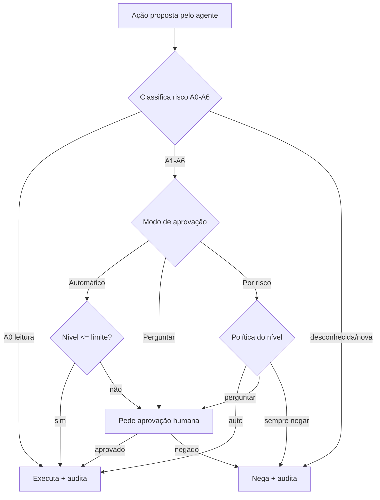

# NOMOS · MOSAIC — Blueprint de Arquitetura e Roadmap (v1)

- **Status:** rascunho para revisão humana (não aprovado)
- **Data:** 2026-07-09 (UTC)
- **Escopo:** produto novo `nomos.mosaic` — cockpit de múltiplas telas de Chrome operadas por agente, com chat, voz em tempo real e aprovações governadas.
- **Método:** loop-100 (SPEC → IMPLEMENTAR → TESTAR → VALIDAR → EVIDENCIAR → ENTREGAR).
- **Base:** módulo `src/nomos/mosaic/` já esqueletado (layout, registry, knowledge, browser, engine, panel, cli).
- **Revisão v1.1 (2026-07-09):** incorporado o modelo de voz/interação (chat + áudio + tempo real), **agentes nomeados** (maestro + trabalhadores por tela), **catálogo de skills** de alto nível e **dashboard de controle ao vivo**.
- **Revisão v1.2 (2026-07-09):** decisões travadas (maestro+trabalhadores, os dois modos de voz), **controle compartilhado** (o usuário entra junto) e **modo "aprender"** com recorte realista (memória + mapa de UI sim; fine-tuning por cliente não).
- **Revisão v1.3 (2026-07-09):** restrição de negócio **SaaS turnkey, leve, ticket baixo/médio**. Confirmado **OmniParser primário** (pipeline único, sem integração por serviço) com custo de GPU domado por **planos por tier + cotas**; **v1 = e-mail + alguns serviços**; **voz por tiers de assinatura**; **onboarding "conectar telas"** e o **piso honesto de custo** documentados.
- **Revisão v1.4 (2026-07-09):** **cérebro em cascata** — API oficial / regras / modelo pequeno local resolvem ~80% das ações; o LLM caro entra só na **geração**. Baixa o COGS ~1/3 (margens 74–84%) e tira o Business do prejuízo no caso pesado. Nuance à "visão pura": o OmniParser continua **vendo** tudo; onde há API oficial, as **ações** vão pela API.
- **Revisão v1.5 (2026-07-09):** **cliente 100% web, zero instalação** — nada roda na máquina do cliente; ele só abre o navegador. Todo browser, visão, voz e cérebro é **server-side**. Onde o doc diz "local" (ex.: modelo pequeno da cascata), leia **"no nosso servidor"**, não no computador do cliente.

> Nota de honestidade: o **papel** de cada módulo abaixo vem da sua descrição e dos nomes dos arquivos. O bridge do desktop caiu antes de eu ler o conteúdo dos `.py`, então a seção "Mapa dos módulos" deve ser **conferida contra o código real** quando reconectar. Nada aqui foi inventado sobre a implementação interna.

---

## 0. Resumo executivo

O **Mosaic** é um "Chrome dentro do Chrome": o cliente abre um painel web e vê um **mosaico de várias telas de Chrome ao vivo** (1 a 16), cada uma com **login isolado** (e-mails e serviços diferentes que não se misturam). Ao lado, um **chat com histórico** e um **botão de falar em tempo real** (voz). Um **agente** enxerga todas as telas, entende o conteúdo e **executa ações mediante pedido + aprovação** — com aprovação **automática, com perguntas, ou por nível de periculosidade**.

Três decisões já estão travadas:

1. **Execução: SaaS hospedado.** Os browsers rodam no **seu servidor**; o cliente só abre o painel. Encaixa com múltiplas contas, muitas telas e custos de API inclusos.
2. **Visão: OmniParser primário.** Cada screenshot vira lista de elementos clicáveis (visão pura).
3. **Entrega desta rodada: este blueprint** (sem código ainda).

E o modelo de negócio: **turnkey**. O cliente contrata e **todos os custos de API já vêm inclusos** (OpenAI Realtime para voz, OmniParser em GPU para visão, tokens de raciocínio). O cliente **nunca vê uma chave de API**.

A tensão central — um produto de **nuvem** nascendo dentro de um repo **"local por lei"** — é real e tem solução limpa: **reaproveitar o kernel de governança do NOMOS** (gate de aprovação A0–A6, cofre Argon2id, auditoria em cadeia de hash), **isolar a visão AGPL como serviço externo** (Regra 6) e **medir custo por tenant** para o "tudo incluso" fechar a conta. As seções a seguir detalham cada peça.

---

## 1. Decisões travadas nesta rodada

| Decisão | Escolha | Consequência principal |
|---|---|---|
| Onde os browsers rodam | **Nuvem hospedada (SaaS)** | Fleet de Chrome server-side; frontend só renderiza e comanda. Escala telas sem pesar na máquina do cliente. |
| Como o agente enxerga/age | **OmniParser primário (visão pura)** | Serviço de visão em GPU; custo por ação → precisa de gate de custo (parse só quando a tela muda). |
| Entrega desta rodada | **Blueprint + roadmap** | Documento agora; código nas missões MC seguintes. |
| Modelo comercial | **Turnkey, custos de API inclusos** | Metering + cotas por tenant são parte da arquitetura, não um detalhe. |
| Escopo do v1 vendável | **E-mail + alguns serviços** | Começa estreito e confiável; expande depois. |
| Voz no ticket | **Por tiers de assinatura** | Texto+áudio no plano base; tempo real nos planos acima. |
| Leveza / margem | **OmniParser com parse-on-change + cotas por tier** | GPU sob controle: parseia pouco, cobra por plano. |
| Cérebro / decisão | **Cascata: API/regras/local → LLM barato só na geração** | LLM é ~10–20% das ações; corta COGS ~1/3, margem 74–84%. |
| Cliente / instalação | **100% web, zero instalação** | Só um navegador; browsers, visão, voz e cérebro rodam no servidor. |

---

## 2. A experiência (o "Chrome dentro do Chrome")

O cliente **não instala nada** — abre o painel no navegador (só isso é necessário) e vê:

- **Mosaico ao vivo** — grade que se auto-organiza de 1 a 16 telas. Cada célula é um Chrome real, com um serviço logado (Gmail pessoal, Gmail do trabalho, um banco, um ERP, um WhatsApp Web…). Logins **não interferem** entre si.
- **Chat com histórico** — a conversa persiste; dá para retomar de onde parou, em qualquer dispositivo.
- **Voz — como um ChatGPT falado** — em **três formas**: digitar no chat, mandar um **áudio** (assíncrono) ou **conversa em tempo real** (ao vivo). Você chama os **agentes pelo nome** — *"olá, agente 1, responde todos os meus e-mails"* — e o agente narra o que faz e **pede aprovação por voz**.
- **Dashboard de controle ao vivo** — além das telas, o painel mostra **cada agente e o que ele está fazendo** (ocioso / trabalhando / esperando aprovação), com botões de pausar, assumir e aprovar.
- **Aprovações inline** — quando o agente quer fazer algo sensível, aparece um **card** com: o que vai fazer, em qual tela, o **nível de risco** e um **diff** (ex.: "enviar este e-mail para fornecedor@x"). Você aprova/nega — ou deixa no piloto automático, conforme o modo.

Fluxo típico (por voz): *"olá, agente 1 — separa meus e-mails, responde os do fornecedor e me dá o resumo do dia."* O **maestro** entende o pedido, aciona o trabalhador da tela certa, que **vistoria** (leitura A0, livre), **planeja**, faz a triagem e o resumo sozinho, e **para para pedir aprovação** no envio (A3) — tudo aparecendo no **dashboard de controle ao vivo**, onde você vê cada agente trabalhando e pode pausar, assumir ou aprovar.

---

## 3. Arquitetura em camadas

```
┌──────────────────────────────────────────────────────────────────────┐
│ A. PAINEL (frontend web)                                               │
│    mosaico 1→16 · chat+histórico · botão voz · cards de aprovação      │
│    recebe frames ao vivo · envia comandos                              │
└───────────────▲───────────────────────────────────────▲───────────────┘
                │ frames (screencast) / eventos          │ áudio (WebRTC)
┌───────────────┴───────────────────────────────────────┴───────────────┐
│ B. GATEWAY / API + BROKER REALTIME                                     │
│    auth · sessões · WebSocket/WebRTC · roteia comandos e voz           │
│    (a chave OpenAI vive AQUI, nunca no cliente)                        │
└───┬──────────────┬───────────────┬───────────────┬────────────────────┘
    │              │               │               │
┌───▼────────┐ ┌───▼──────────┐ ┌──▼───────────┐ ┌─▼────────────────────┐
│ C. FLEET   │ │ D. VISÃO     │ │ E. COGNIÇÃO  │ │ F. GOVERNANÇA        │
│ browsers   │ │ OmniParser   │ │ agente       │ │ (kernel NOMOS)       │
│ Playwright │ │ (serviço GPU │ │ planner ↔    │ │ gate A0–A6           │
│ 1 contexto │ │  EXTERNO,    │ │ executor +   │ │ modos de aprovação   │
│ isolado/   │ │  AGPL isolado│ │ vistoria +   │ │ auditoria hash-chain │
│ tela       │ │  → elementos)│ │ roteador     │ │ cofre Argon2id       │
└───┬────────┘ └──────────────┘ └──────────────┘ └──────────────────────┘
    │
┌───▼────────────────────────────────────────────────────────────────────┐
│ G. MULTI-TENANT / SAAS  — tenants · billing · metering de custo · cotas │
│ H. PERSISTÊNCIA — Postgres (control plane) · object storage cifrado     │
│    (profiles, frames) · histórico de chat · snapshots · auditoria       │
└─────────────────────────────────────────────────────────────────────────┘
```

**Laço de operação (o que acontece a cada passo do agente):**

```
objetivo (texto/voz)
   → planner decide o próximo passo e a tela-alvo
   → captura frame da tela
   → OmniParser transforma o frame em elementos (bbox, tipo, texto, clicável?)
   → executor escolhe a ação (click/type/navigate/read)
   → classificador de risco atribui nível A0–A6
   → GATE de aprovação aplica o MODO (auto / perguntar / por risco)  ── nega se desconhecido (fail-closed)
   → se liberado: Playwright executa
   → observa o resultado, audita (hash-chain) e volta ao planner
```

Diagrama do gate (Mermaid, para render posterior):



---

## 4. Mapa dos módulos (o que já existe × o que falta)

O esqueleto atual em `src/nomos/mosaic/` (a **conferir** contra o código real):

| Módulo | Papel (pela sua descrição) | Camada | O que ainda falta para a visão completa |
|---|---|---|---|
| `layout.py` | grade que se auto-organiza 1→16 | A (painel) | servir o layout ao frontend; tela focada em alta resolução, resto em thumbnail |
| `registry.py` | cada tela com **perfil isolado** (login não interfere) | C (fleet) | profiles **persistentes e cifrados** por tenant; ciclo de vida (criar/pausar/encerrar tela) |
| `knowledge.py` | a **vistoria** — faz o agente já saber o conteúdo | E (cognição) | snapshot por tela versionado; invalidação quando a tela muda |
| `browser.py` | adaptador (demo agora / **Playwright** no go-live) | C (fleet) | implementação Playwright real atrás da mesma interface; contrato de ações |
| `engine.py` | laço do agente + ação **dry-run com aprovação**; desconhecida → **fail-closed** | E + F | plugar OmniParser, roteador de modelos, e o gate A0–A6 de verdade |
| `panel.py` | HTML do painel | A (painel) | mosaico ao vivo, chat com histórico, voz, cards de aprovação com risco |
| `cli.py` | `--add` (adiciona tela), `--scan` (vistoria), `--panel` (monta painel) | operação/dev | manter como superfície de operador/dev; produto final é o painel web |
| `__main__.py` | entrypoint | — | — |

**Peças novas que a visão exige (ainda não existem):**

- **Voz (áudio assíncrono + tempo real)** — transcrição no servidor + broker OpenAI Realtime — camada B.
- **Modelo multi-agente** (maestro + trabalhadores por tela, endereçáveis por nome) — camada E.
- **Catálogo de skills de alto nível** (resumo do dia, triagem/separar, responder e-mails) governadas — camadas E/F.
- **Dashboard de controle ao vivo** (status por agente, pausar/assumir) além dos cards de aprovação — camada A.
- **Serviço OmniParser externo** + cliente + gate de custo (parse-on-change) — camada D.
- **Streaming de frames** pro frontend (mosaico ao vivo) — A↔B.
- **Modelo de risco A0–A6 + 3 modos de aprovação** (hoje há dry-run + fail-closed genérico) — camada F.
- **Multi-tenant, cofre por tenant, metering de custo e cotas** — camadas G/H.

---

## 5. Modelo de aprovação e risco (o coração do produto)

Sua descrição — *"aprovação automática, ou com perguntas, ou níveis de periculosidade"* — vira dois eixos: **uma taxonomia de risco** (o que a ação é) e **um modo** (como o gate reage a ela). Reaproveitamos a escala **A0–A6** do NOMOS, aplicada a ações de browser:

| Nível | O que é | Exemplos | Padrão sugerido |
|---|---|---|---|
| **A0** | Leitura / vistoria | ler tela, listar inbox, screenshot, parse | sempre permitido (auditado) |
| **A1** | Navegação benigna | abrir URL/aba em serviço já logado, rolar, buscar | auto |
| **A2** | Preparo reversível | preencher rascunho **sem enviar**, marcar como lido, arquivar | auto (reversível) |
| **A3** | Comunicação | **enviar** e-mail/mensagem/resposta, postar comentário | perguntar |
| **A4** | Valor / dado sensível | mover valor baixo, alterar/excluir dados, aprovar transação pequena | perguntar |
| **A5** | Credencial / identidade | **login**, digitar senha/MFA, mudar config. de conta, adicionar dispositivo | perguntar (forte) |
| **A6** | Crítico / irreversível / escala | pagamento alto, ação em massa, exclusão em massa, jurídico/contratual | **negado por padrão** (só com pré-autorização explícita + dupla confirmação) |

**Os três modos (o que o cliente escolhe):**

- **Automático (piloto)** — auto-aprova até um limite (ex.: ≤ A2) e **pergunta acima**. Fluxo rápido para tarefas repetitivas.
- **Perguntar (copiloto)** — pergunta **tudo acima de A0**. Supervisão máxima.
- **Por risco (personalizado)** — política por nível e por escopo: *auto até X, perguntar de Y a Z, sempre-negar ≥ W* — configurável por **tenant, por serviço e por tela** (ex.: no Gmail pessoal pode enviar sozinho; no banco, nunca sem OK).

**Regras invioláveis do gate:**

- **Fail-closed sempre.** Ação desconhecida/nova ou nível não classificado → **nega**. Em execução headless/CI → nega, **sem flag de bypass** (herança direta do NOMOS).
- **Pré-autorizações com escopo e validade.** Ex.: *"pode responder e-mails do domínio @fornecedor pela próxima 1h"* — expira sozinho, é auditado, e nunca cobre ≥ A5.
- **Quem aprova vê o quê.** Card com ação, alvo, tela, nível e diff. Na voz, o agente descreve e pergunta *"posso?"* antes de agir.

---

## 6. Camada de visão — OmniParser como **serviço externo** (Regra 6)

Confirmado no cartão do modelo: no **OmniParser v2**, o `icon_detect` é **AGPL-3.0** (YOLOv8 finetunado) e o `icon_caption` é **MIT**. A **Regra 6** do NOMOS ("componente AGPL nunca linkado — só processo externo") portanto **obriga** que o OmniParser rode como **serviço/processo separado**, nunca importado no pacote `nomos`. Felizmente, **é exatamente a arquitetura de SaaS escolhida**: um **microserviço de visão em GPU** que o agente consome por REST/gRPC.

**Pipeline:** `frame → serviço OmniParser → [elementos: bbox, tipo, texto (OCR), interatável?] → agente`.

**Controle de custo (essencial, porque visão pura em GPU custa por ação e os custos são inclusos):**

- **Gate de diferença de frame** — só re-parseia a tela quando ela **muda de verdade** (hash/diff do frame), não a cada quadro.
- **Cache por tela** — reaproveita o último parse enquanto a tela está estável.
- **Resolução adaptativa** — tela focada em alta; telas de fundo em baixa/thumbnail.
- **Parse sob demanda** — o agente pede visão quando **precisa agir**, não continuamente.

**Por que manter OmniParser primário (decisão confirmada) — o trade honesto:** vale porque é **um pipeline único para qualquer serviço** — o agente vê e age do mesmo jeito no Gmail, no banco ou num ERP, **sem construir e manter uma integração de API por serviço**. Isso dá cobertura ampla mais rápido ("chega pronto" pra muitos serviços). O preço é **custo de GPU em runtime**. Ou seja, OmniParser-primário troca **complexidade de construção** por **custo de operação**.

Para esse custo caber num ticket baixo/médio, os controles acima **não são opcionais** — parse-on-change, cache e parse sob demanda cortam as chamadas de GPU por um fator grande (uma sessão de e-mail no ritmo humano parseia a tela só algumas vezes por minuto). Somados a GPU com autoscale/quantização e **cotas por plano** (seção 8), fecham a conta.

> Alavanca de margem guardada (não muda a decisão): onde existir **API oficial** (Gmail/Outlook), dá para rodar por baixo sem GPU. Fica registrado caso a margem aperte — mas o v1 segue com **OmniParser primário**, como decidido.

---

## 7. Voz, interação e agentes nomeados

A interação é **como um ChatGPT de voz** — só que ligado às telas (via OmniParser) e capaz de **agir**. Três formas de falar com o sistema, todas alimentando o mesmo agente e o mesmo gate de aprovação:

- **Texto (chat)** — digita no painel; histórico persistente.
- **Áudio assíncrono** — grava um recado de voz (transcrição no servidor) e o agente responde. Mais barato; bom para comando rápido.
- **Tempo real (ao vivo)** — conversa contínua via **OpenAI Realtime** (WebRTC). O agente narra o que faz, escuta e **pede aprovação por voz**.

Em todos os casos a **chave OpenAI vive no servidor**, nunca no cliente (herança do "chaves nunca no chat" do NOMOS), e o **custo (minutos de Realtime / transcrição) entra no metering** (seção 8).

### 7.1 Agentes nomeados — maestro + trabalhadores por tela

Você fala com o sistema chamando **agentes pelo nome/número** — *"olá, agente 1, responde todos os meus e-mails"*. O modelo recomendado é **hierárquico**:

- **Maestro** — orquestrador que entende o pedido amplo, decide quais telas envolver e coordena. É com ele que você fala quando o pedido é geral (*"me dá o resumo do dia"* → ele varre todas as telas).
- **Agentes por tela (trabalhadores)** — cada tela tem um trabalhador com nome/número (*agente 1 = tela 1*). Dá para endereçar um direto (*"agente 3, separa os e-mails de cobrança"*) e ele age só naquela tela, com o profile isolado dela.
- **Governança compartilhada** — maestro e trabalhadores passam pelo **mesmo gate A0–A6** e pela **mesma auditoria**. Um trabalhador nunca se auto-aprova; ação sensível sobe pro seu OK, não importa quem pediu.

> Decisão em aberto (recomendação já marcada): adotar **maestro + trabalhadores** em vez de agentes totalmente independentes — dá para endereçar cada tela pelo nome **e** ter coordenação global, sem duplicar governança.

### 7.2 Comandos de alto nível (catálogo de skills governadas)

Os exemplos que você deu — *"responde todos os meus e-mails"*, *"separa meus e-mails"*, *"resumo do dia"* — viram **skills/rotinas nomeadas**, cada uma com nível de risco declarado e passo de aprovação:

| Comando | O que faz | Risco típico |
|---|---|---|
| **Resumo do dia** | varre as telas e entrega um briefing (o que chegou, o que é urgente) | A0 (leitura) |
| **Separar e-mails (triagem)** | classifica / rotula / arquiva por categoria | A2 (reversível) |
| **Responder e-mails** | redige e **envia** respostas (uma a uma, ou em lote com pré-autorização) | A3 (envio) |
| **Agendar / pagar / mover valor** | ações em serviços financeiros | A4–A6 (sempre pergunta / negado por padrão) |

Cada skill é **governada** — declara o que faz, com risco visível e aprovação — exatamente o modelo de "skills governadas" que o NOMOS já tem. Rotinas também podem ser **agendadas** (ex.: "resumo do dia às 8h"), como o `nomos rotinas` já faz.

### 7.3 Dashboard de controle interativo em tempo real

O painel não é só o mosaico: é um **cockpit ao vivo**. Para cada agente/tela mostra **status** (ocioso / trabalhando / esperando aprovação), a **tarefa atual** e o **progresso**, com **controles rápidos** (pausar, assumir o controle, aprovar/negar). É o "dashboard de controle interativo em tempo real" — você vê os agentes trabalhando e intervém a qualquer momento.

### 7.4 Colaboração e handoff — você pode entrar junto

Você (o usuário) pode **interagir junto com o agente** a qualquer momento — **controle compartilhado**: enquanto o agente opera uma tela, você assume, digita/clica você mesmo, corrige o rumo e devolve o controle, **sem perder a sessão nem a auditoria**. É o "com a gente" no sentido de **co-pilotar**.

*(Opcional, a confirmar depois: um **operador humano do time Se7enpay** também poder entrar na sessão — a mesma costura de controle compartilhado atende os dois casos.)*

### 7.5 Modo "aprender" — o que é realista (e o que não é)

Boa ideia, e vale fazer — mas "aprender" são **coisas diferentes**, com custos e riscos bem diferentes. Sendo honesto:

**Vale muito (barato e seguro) — começar por aqui:**

- **Memória de preferências e correções** — o agente guarda o que você corrige (*"newsletters vão pro arquivo"*, *"com o fornecedor, tom formal"*) e consulta depois. Não é o modelo "ficando mais inteligente"; é **memória estruturada por usuário e por tela** (o NOMOS já tem memória local). Funciona bem, risco baixo.
- **Mapa de UI aprendido por serviço** — o agente memoriza onde ficam as coisas em cada serviço (o botão "responder" deste webmail, o fluxo de login daquele banco). Além de entender melhor, **reduz custo**: re-parseia menos com o OmniParser porque reaproveita âncoras estáveis. É o "aprender" que **paga o próprio custo**.

**Vale, com ressalva (mais frágil):**

- **Aprender por demonstração** — você faz uma vez, o agente grava os passos e repete. Repetir o mesmo fluxo é confiável; **generalizar** para variações (layout diferente, um campo a mais) é onde esses sistemas costumam quebrar. Dá pra fazer, com expectativa realista e sempre validando.

**Geralmente NÃO vale (não vou vender ilusão):**

- **Treinar / fine-tunar um modelo por cliente** — caro, lento, pesado de privacidade, e raramente melhor que memória + exemplos. Recomendo **não** ir por aí: memória + few-shot entrega quase todo o ganho sem o custo.

**Guarda-costas inegociável:** o que foi "aprendido" **não vira auto-aprovado**. Um atalho ensinado herda o **mesmo nível de risco** (A0–A6) e continua pedindo OK conforme o modo. Senão vira brecha — imagina ensinar *"paga esse boleto"* e ele passar a pagar sozinho. Aprender melhora **compreensão e velocidade**, nunca **fura a aprovação**.

### 7.6 Cérebro em cascata — por que o LLM é só a fina camada de cima

Pergunta certa: *por que usar LLM, se ele é o maior custo?* Resposta honesta: **não se troca o LLM por "uma API" — reduz-se o LLM ao mínimo e joga-se a maior parte do trabalho em camadas baratas.** O agente decide em **cascata**, parando na primeira camada que resolve:

1. **API oficial do serviço** (Gmail API, Microsoft Graph, Calendar…) — ler, rotular, arquivar, enviar. Determinístico, rápido (ms), barato. É a "API" que você perguntou: onde existe, ela faz o trabalho estruturado **sem LLM**.
2. **Regras / filtros** — triagem por remetente, domínio, assunto e as categorias nativas do provedor. A maior parte do "separar e-mails" é regra, não IA.
3. **Modelo pequeno próprio, no nosso servidor** (o cérebro leve do NOMOS rodando server-side, na mesma GPU do OmniParser — **não** na máquina do cliente) — entender o comando, classificar, decidir o próximo passo. Custo marginal ~zero.
4. **Macros determinísticas** — em serviço sem API, os fluxos conhecidos ("responder = clicar X, digitar, clicar enviar") são **código** sobre as coordenadas do OmniParser, não decisão de LLM.
5. **LLM barato da nuvem (nano/mini)** — só para o que **realmente gera**: redigir uma resposta com nuance, escrever o resumo do dia, ou lidar com um pedido/tela nunca vistos.

Só ~10–20% das ações chegam à camada 5. Isso é o que deixa **leve, rápido e eficiente**: API e regra respondem em milissegundos; o LLM caro entra pouco.

**Impacto medido** (`mosaic_custos.py`, caso esperado): a cascata corta o COGS total **~31–37%** (Base R$22→14, Pro R$85→57, Business R$267→183) e sobe a margem para **~74–84%**. Decisivo: o **Business deixa de ficar negativo** no cenário de uso pesado (−12% → +12%), porque a cascata impede o LLM de explodir.

**O trade honesto (a confirmar):** isso reintroduz **integração por serviço** (construir/manter a API do Gmail, do Outlook…) — o que a "visão pura universal" evitava. A visão continua **100% OmniParser** (o agente enxerga qualquer tela igual); o que muda é que, **onde há API oficial, as ações e leituras vão pela API** em vez de dirigir a UI. Híbrido: OmniParser universal para **ver**, API/regra/local para **agir barato**. Troca um pouco de simplicidade de construção por muito custo de operação a menos.

---

## 8. Multi-tenant, isolamento e "custos inclusos"

- **Hierarquia:** tenant → usuários → sessões → telas. **Isolamento duro** entre tenants (browsers, profiles, auditoria e storage nunca se cruzam).
- **Cofre por tenant** (Argon2id, herdado do NOMOS): guarda cookies/credenciais/profiles **cifrados**. O cliente **loga uma vez** (assistido) e o profile **persiste** — não precisa relogar toda hora.
- **Metering de custo** — medir, por tenant: **minutos de Realtime**, **GPU-segundos de OmniParser**, **tokens de raciocínio**. É isso que torna o "tudo incluso" **sustentável**: casa consumo com plano, aplica **cotas** e **degrada com aviso** ("você está perto do limite do mês") em vez de estourar a margem.
- **Planos por tier** (ver 8.1) — telas, ações/mês, minutos de voz e **cota de visão (GPU)** escalam por plano.

### 8.1 Planos por tier (como o "incluso" cabe no ticket)

O "tudo incluso" é **por plano**, não ilimitado. Cada tier casa consumo com preço:

| Tier | Telas | Voz | Visão (GPU) / ações | Perfil |
|---|---|---|---|---|
| **Base (ticket baixo)** | 1–3 | texto + áudio assíncrono | cota mensal enxuta | assistente de e-mail |
| **Pro** | até ~8 | + tempo real (X min/mês) | cota maior | mais serviços/telas |
| **Business** | até 16 | tempo real ampliado | cota alta + prioridade | operação pesada |

Voz em tempo real (a parte cara) fica nos tiers acima — a sua escolha de "diferentes assinaturas". Passou da cota, **degrada com aviso** (não estoura a margem nem surpreende o cliente).

### 8.2 Onboarding turnkey — assinar → entrar → conectar telas

O produto **chega pronto**. O cliente: (1) assina, (2) entra, (3) roda o assistente de **"conectar telas"** — um passo a passo que abre cada serviço, ele faz login (o agente só observa; senha/MFA são **A5**, nunca capturadas em texto) e a **sessão fica guardada no cofre** para não relogar toda hora. Zero configuração técnica.

### 8.3 Leveza de runtime

Três alavancas seguram o custo por cliente: **browsers sob demanda** (sobem quando há tarefa ou você está olhando a tela; telas ociosas hibernam com o profile salvo — nada de 16 Chromes ligados 24h), **roteador de modelos** (modelo barato no trivial, caro só quando precisa — o NOMOS já tem) e **cotas por tier** (a trava de margem).

### 8.4 O piso honesto de custo

Sendo realista: com **OmniParser primário**, a GPU põe um **piso** no custo — o ticket base não será quase-zero como seria numa abordagem só-API. Com os controles acima dá para chegar num **ticket baixo/médio** com margem sã; o que **não** fecha é oferecer visão em GPU **ilimitada** num plano barato. Por isso os tiers e as cotas são parte da arquitetura, não um detalhe comercial.

---

## 9. Persistência e auditoria

- **Histórico de chat** por sessão — persistente e pesquisável, retomável em qualquer dispositivo.
- **Snapshots de conhecimento** (vistoria) por tela — o que o agente "sabia" e quando.
- **Auditoria em cadeia de hash** (herdada do NOMOS) — **cada ação + decisão de aprovação + alvo + tela + quem aprovou**. Num produto que **loga no e-mail e nos serviços de terceiros do cliente**, isso é inegociável: é a prova de "quem fez o quê, quando e com que autorização".
- **Control plane** em Postgres; **profiles e frames** em object storage cifrado; **retenção configurável** (LGPD) com expurgo.

---

## 10. Reconciliação com "local por lei"

O NOMOS é **local-first por lei**; o Mosaic é **nuvem por natureza**. Você mesmo já sinalizou: *"projeto novo, diferente dos outros"*. **No Mosaic nada roda na máquina do cliente** — nem browser, nem visão, nem modelo; ele usa só o navegador e todo o resto é server-side (quando este doc diz "local", é o **nosso** servidor, não o computador do cliente). Resolvo a tensão sem trair a marca:

- **Reaproveita 1:1 o kernel de governança** — gate de aprovação, escala A0–A6 fail-closed, cofre Argon2id, auditoria hash-chain. Esse kernel é **agnóstico de local/nuvem**.
- **Inverte só o "cadeado".** No NOMOS, o *locality lock* bloqueia saída para a internet por padrão. No Mosaic, a nuvem é o meio — então o equivalente vira um **"cadeado de escopo por tenant"**: por padrão o agente **só toca nas telas/serviços que aquele tenant autorizou**; qualquer coisa fora do escopo é **fail-closed**.
- **Moradia do código (decisão em aberto).** Recomendo **extrair o kernel de governança para um pacote comum** (ex.: `nomos.kernel`) consumido tanto pelo NOMOS local quanto pelo Mosaic hospedado, e tratar o Mosaic como **produto de nuvem governado** com deployment próprio — não como regressão do local-first. Regra 5 (o site reflete o produto) e Regra 7 (dogfooding) continuam valendo.

---

## 11. Roadmap por missões (loop-100 / ciclos MC)

Cada missão nasce com **SPEC → entregável → evidência (teste + CHANGELOG)**, ruff+pytest 100% limpos, branch local, **sem push** (humano publica).

> **Alvo do v1 vendável:** e-mail + alguns serviços via pipeline **OmniParser** (parse-on-change), **planos por tier** e onboarding "conectar telas". O resto (mais serviços, tempo real amplo, aprender) vem nos tiers/fases seguintes.

**Fase 0 — Fundação e governança**
- **MC-MOSAIC-01** · Kernel de governança acessível ao Mosaic (gate A0–A6, cofre, auditoria) + **taxonomia de risco de ações de browser**. *Evidência:* testes de classificação de risco.
- **MC-MOSAIC-02** · Modelo de aprovação: **3 modos** (automático/perguntar/por risco) + pré-autorizações com escopo/validade + fail-closed. *Evidência:* testes de política por modo/nível.

**Fase 1 — Núcleo do mosaico (server-side)**
- **MC-MOSAIC-03** · Registry + **profiles isolados persistentes cifrados** (contextos Playwright). *Evidência:* dois logins isolados não se misturam.
- **MC-MOSAIC-04** · **Adaptador Playwright real** atrás da interface demo/real; contrato de ações (click/type/navigate/read). *Evidência:* ações executam em página de teste.
- **MC-MOSAIC-05** · **Streaming de frames** (screencast adaptativo) + layout 1→16. *Evidência:* painel mostra N telas ao vivo.

**Fase 2 — Visão e cognição**
- **MC-MOSAIC-06** · **Serviço OmniParser externo** (AGPL isolado) + cliente + gate de diferença de frame/cache. *Evidência:* frame → elementos, com re-parse só on-change.
- **MC-MOSAIC-07** · **Laço planner-executor** + **modelo multi-agente** (maestro + trabalhadores por tela, endereçáveis por nome) + vistoria (knowledge) + roteador de modelos; toda ação passa pelo gate. *Evidência:* tarefa multi-passo, endereçada a um agente nomeado, em dry-run.
- **MC-MOSAIC-07c** · **Memória e mapa de UI por serviço** — preferências/correções por usuário e tela + cache de âncoras (reduz custo de parse). *Evidência:* preferência aprendida muda o comportamento; re-parse cai em fluxo repetido. **Aprender nunca auto-aprova — herda o risco A0–A6.**

**Fase 3 — Interação**
- **MC-MOSAIC-08** · **Chat com histórico** persistente + **dashboard de controle ao vivo** (status por agente: ocioso/trabalhando/esperando) + **cards de aprovação** (risco/diff). *Evidência:* histórico retomável; status ao vivo; card aprova/nega.
- **MC-MOSAIC-08b** · **Catálogo de skills de alto nível** governadas (resumo do dia, triagem/separar, responder e-mails) com risco declarado + agendamento (rotinas). *Evidência:* cada skill roda em dry-run com risco e aprovação.
- **MC-MOSAIC-09** · **Voz** — áudio assíncrono (transcrição) **e** tempo real (broker Realtime server-side) + aprovação por voz. *Evidência:* comando por áudio e por voz ao vivo, ambos pedindo OK.
- **MC-MOSAIC-09b** · **Controle compartilhado** — o usuário assume/solta a tela ao vivo, mantendo sessão e auditoria (mesma costura serve para operador do time depois). *Evidência:* handoff ida-e-volta sem perder estado.

**Fase 4 — Produto/SaaS**
- **MC-MOSAIC-10** · **Multi-tenant** + **planos por tier** + **metering** (Realtime/GPU/tokens) + cotas + billing. *Evidência:* consumo medido e limitado por plano; excedente degrada com aviso.
- **MC-MOSAIC-10b** · **Onboarding turnkey** — assinar → entrar → assistente "conectar telas" (login assistido, sessão no cofre). *Evidência:* cliente novo conecta uma conta e roda o "resumo do dia" sem passo técnico.
- **MC-MOSAIC-11** · **Hardening** (LGPD/retenção, isolamento, teste de segurança das telas), site reflete produto (Regra 5) e dogfooding (Regra 7). *Evidência:* checklist de segurança + missão de produto.

---

## 12. Riscos e decisões em aberto

- **Custo de GPU do OmniParser primário** — ✅ **decidido:** manter OmniParser primário; viabilidade vem de parse-on-change/cache (seção 6) + **planos por tier e cotas** (seção 8). Piso de custo assumido; API-first fica guardado como alavanca se a margem apertar.
- **Escopo do v1** — ✅ **resolvido:** e-mail + alguns serviços.
- **Voz no ticket** — ✅ **resolvido:** por tiers de assinatura (base: texto+áudio; tempo real acima).
- **ToS dos serviços de terceiros** — automatizar a **UI** de Gmail, bancos etc. pode violar termos e disparar captcha/MFA/bloqueio de conta. **Decisão de produto:** definir a lista de serviços oficialmente suportados e **preferir APIs oficiais** onde existirem, em vez de dirigir a tela.
- **Superfície de risco altíssima** — um agente logado no e-mail/banco do cliente. Por isso A5/A6 e auditoria são **inegociáveis**, e A6 nasce negado.
- **Modelo de agentes** — ✅ **resolvido:** maestro + trabalhadores por tela (endereçáveis por nome).
- **Formas de voz** — ✅ **resolvido:** áudio assíncrono **e** tempo real.
- **Colaboração** — ✅ **resolvido:** o usuário entra junto (controle compartilhado). *A confirmar depois:* operador humano do time Se7enpay também.
- **Modo "aprender"** — escopo recomendado: começar por **memória de preferências** + **mapa de UI por serviço** (baratos, seguros, cortam custo); demonstração com ressalva; **sem fine-tuning por cliente**. Confirmar se topa esse recorte.
- **Cérebro em cascata (API por serviço)** — a confirmar: aceitar **integração por serviço** (Gmail/Outlook API) para baratear, mantendo o OmniParser como a visão universal. Recomendado — corta ~1/3 do custo e tira o Business do vermelho.
- **Moradia do módulo** — módulo dentro do repo NOMOS **vs** produto separado com `nomos.kernel` compartilhado (recomendo o segundo).
- **Streaming de 16 telas ao vivo** — banda/custo; usar thumbnails + tela focada em alta.
- **Licenciamento no deploy** — manter o OmniParser como serviço externo documentado (Regra 6) e registrar as licenças de cada componente no pacote de release.

---

## 13. Próximos passos

1. **Você valida este blueprint** e fecha as decisões em aberto da seção 12 (principalmente: handoff humano, serviços suportados, moradia do módulo).
2. Quando o **bridge do desktop voltar**, eu **comito este documento** em `docs/architecture/NOMOS_MOSAIC_ARQUITETURA_v1.md` e abro a **MC-MOSAIC-01** no `loop/BACKLOG.md`, no seu formato.
3. A partir daí, seguimos missão a missão pelo loop-100, cada uma com teste e entrada no CHANGELOG.

*Documento gerado para revisão humana. Nenhuma alteração de código foi feita nesta rodada.*
